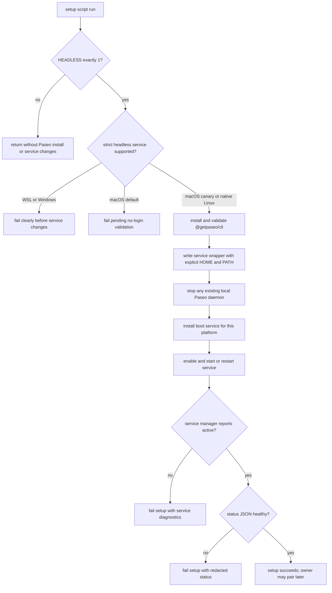
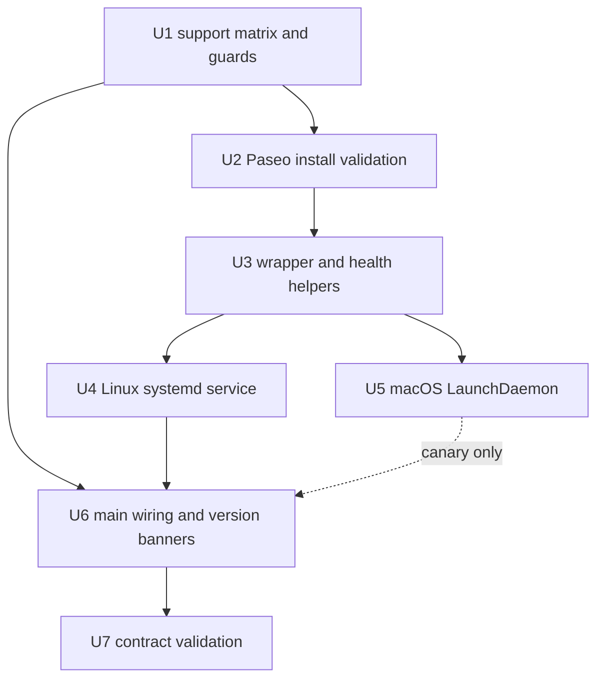

<!-- markdownlint-disable MD025 MD032 MD060 -->

# feat: Configure headless Paseo daemon service

## Summary

Add a strict `HEADLESS=1` Paseo setup path that installs the scoped Paseo CLI package, supervises `paseo daemon start --foreground` with each supported platform's boot service manager, and verifies daemon health locally before the setup can succeed. Native Linux scripts use systemd user services with lingering; macOS is a canary-only LaunchDaemon path until cold-boot/no-login evidence proves it; WSL and native Windows fail clearly until a true no-login boot strategy exists.

---

## Problem Frame

Headless machines need Paseo access after logout or reboot, not just after an interactive setup shell starts a one-off process. The existing setup scripts already treat `HEADLESS=1` as a hard remote-operability signal in some platforms; Paseo daemon setup should follow that contract without changing non-headless runs (see origin: `docs/brainstorms/2026-06-24-headless-paseo-daemon-requirements.md`).

---

## Assumptions

*This plan was authored without synchronous user confirmation. The items below are agent inferences that fill gaps in the input — unvalidated bets that should be reviewed before implementation proceeds.*

- Supported strict headless targets are native Linux `ubuntu.sh`, `omarchy.sh`, `pi.sh`, and `bazzite.sh`. `mac.sh` should expose a canary-only LaunchDaemon path until cold-boot/no-login evidence proves it. `wsl.sh` and `win.ps1` should fail early when `HEADLESS=1` because they cannot currently guarantee a daemon after host reboot without interactive login.
- Paseo should be installed with Bun as `@getpaseo/cli`, matching the repository's existing global AI CLI installation style, even if an older or unrelated `paseo` command is already on `PATH`.
- Health verification should require service-manager active state plus `paseo daemon status --json` reporting `localDaemon=running` and local API reachability (`connectedDaemon=reachable`, or `auth_required` for password-protected local daemons, in current CLI output), with relay configuration not disabled. This should not require external relay connectivity unless Paseo exposes a separate local-safe signal for it.
- Non-headless reruns should leave any pre-existing Paseo installation or service alone rather than uninstalling or disabling it.

---

## Requirements

- R1. When setup runs with `HEADLESS=1`, install or update the Paseo CLI/daemon package needed to run a local daemon.
- R2. When `HEADLESS=1`, configure Paseo as a boot-managed background service using the supported platform's service mechanism.
- R3. The configured daemon must start without an interactive login session on supported platforms.
- R4. Setup must enable and start the Paseo daemon service during the run.
- R5. Setup must verify the daemon is running and locally reachable before considering Paseo setup complete.
- R6. When `HEADLESS` is not exactly `1`, do not install Paseo or create/start a Paseo daemon service for this feature.
- R7. When `HEADLESS=1`, fail the setup if installation, service configuration, enablement, start, or health verification fails.
- R8. If a setup path cannot support a real boot-managed Paseo daemon, fail clearly instead of silently skipping daemon setup.
- R9. Preserve Paseo's default relay-based connection model; do not open inbound network ports.
- R10. Do not perform automatic pairing, print pairing links, or require pairing for service health verification.
- R11. Leave the owner able to run Paseo's normal pairing command later after the daemon is running.

**Origin actors:** A1 machine owner, A2 headless machine, A3 Paseo client, A4 setup script.

**Origin flows:** F1 headless setup provisioning, F2 non-headless setup run, F3 later manual pairing.

**Origin acceptance examples:** AE1 supported headless install/service/verify, AE2 non-headless no-op, AE3 hard failure on service or health failure, AE4 relay/manual-pairing model preserved.

---

## Scope Boundaries

- No automatic pairing, pairing-link display, QR output, or pairing material storage during setup.
- No inbound firewall/LAN/public port changes for Paseo connectivity.
- No provider credential setup beyond existing agent/provider install paths.
- No shell profile or dotfile configuration changes; services must set their own non-interactive `PATH` and `HOME`.
- No Windows-native or WSL strict headless daemon support in this implementation beyond clear `HEADLESS=1` failure.
- No cleanup of existing Paseo installs or services on non-headless runs.

### Deferred to Follow-Up Work

- Windows-native no-login support: revisit if Paseo ships a first-party Windows service wrapper or if a credentialed Task Scheduler strategy is explicitly accepted.
- WSL host-boot support: revisit if a Windows-side startup mechanism should launch the distro and then rely on the in-distro daemon.
- Rename `ensure_pi_node_runtime` to a generic Node-runtime helper after Paseo is working; the first implementation can reuse it to avoid broad helper churn.
- Move managed service files into chezmoi only if this direct setup-script approach proves too duplicated.

---

## Context & Research

### Relevant Code and Patterns

- `ubuntu.sh`, `omarchy.sh`: existing `HEADLESS=1` handling in `detect_machine_type()` and `setup_headless_sudo()` establishes headless as a hard remote-operability signal.
- `mac.sh`: existing `install_betterdisplay()`, `configure_power_settings()`, and `enable_screen_sharing()` are gated on `HEADLESS=1` and run only for headless macOS setup.
- `ubuntu.sh`, `omarchy.sh`, `pi.sh`, `bazzite.sh`, `wsl.sh`: `enable_user_lingering()` and `install_ccgram()` provide the closest systemd-user patterns, but their warning/skip behavior must be tightened for Paseo.
- `install_pi_cli()` and `ensure_pi_node_runtime()` across Bash scripts and `Install-PiCli` / Node-runtime helpers in `win.ps1` are the closest global Bun CLI install and validation patterns.
- `win.ps1`: `Test-EnvLocalFlag` can read `HEADLESS=1` from process environment or `~/.env.local` for an early unsupported-platform failure.
- `lefthook.yml`, `.shellcheckrc`, `.markdownlint.json`: validation is currently static linting rather than a runtime integration-test harness.

### Institutional Learnings

- `docs/plans/2026-03-02-feat-persistent-claude-remote-control-sessions-plan.md` reinforces `loginctl enable-linger`, explicit non-interactive `PATH`, and avoiding invalid systemd user-unit dependencies on system targets.
- `docs/plans/2026-05-07-002-feat-migrate-pi-earendil-works-package-plan.md` is the best cross-script precedent for Bun global package validation, version banner bumps, and Bash/PowerShell parity.
- No `docs/solutions/` learning corpus exists in this repository.

### External References

- Paseo local CLI discovery: `@getpaseo/cli` exposes `paseo daemon start --foreground`, `paseo daemon status --json`, `paseo daemon stop`, and `paseo daemon pair`; setup must not run the pairing command.
- systemd references: `loginctl enable-linger`, `systemctl --user`, `systemd.unit`, `systemd.service`, and `default.target` documentation support a user service with lingering for no-login startup.
- Apple launchd references: LaunchDaemons in `/Library/LaunchDaemons` run at boot; LaunchAgents are login-scoped. `launchd.plist` supports `UserName`, `EnvironmentVariables`, `WorkingDirectory`, `KeepAlive`, and log paths.
- Microsoft Windows Services / Task Scheduler documentation: plain foreground CLIs are not Windows services; no-login scheduled tasks require careful security context/credential choices and should not be claimed as supported here.
- Microsoft WSL documentation: systemd services inside WSL do not keep the WSL instance alive and do not by themselves start the distro at Windows boot.

---

## Key Technical Decisions

- Platform support matrix: support native Linux scripts (`ubuntu.sh`, `omarchy.sh`, `pi.sh`, `bazzite.sh`) as the first claimable target set; keep macOS as a canary-only LaunchDaemon path until no-login evidence proves it; fail early for WSL and native Windows when `HEADLESS=1`. This satisfies R8 without over-promising host-boot behavior.
- Foreground process supervision: service managers should run `paseo daemon start --foreground`, not the default backgrounding command, so systemd/launchd can track and restart the daemon.
- User-owned daemon state: run the service as the setup user with that user's `HOME` and Paseo state; do not run the daemon as root.
- Scoped package validation: install `@getpaseo/cli` through Bun and validate that `paseo` resolves to the scoped package, because the unscoped `paseo` npm package is unrelated.
- Wrapper over shell profiles: write a managed `~/.local/bin/paseo-daemon-start` wrapper that sets stable service `PATH` values and `HOME`; do not depend on fish/zsh/bash profile initialization.
- Strict failure path: every `HEADLESS=1` install/service/health failure returns non-zero and is wired from `main()` with a hard abort; optional-agent warning patterns are not sufficient.
- Health check without pairing: require service-manager active state, managed-service identity checks where feasible, and parse `paseo daemon status --json`; never execute `paseo daemon pair` during setup. Current Paseo output treats `connectedDaemon=reachable` as local API reachability; `auth_required` can also prove local reachability for password-protected daemons, while `auth_failed` should fail.
- LaunchDaemon over LaunchAgent on macOS: no-login startup requires the system domain with `UserName`; a user LaunchAgent would only run after login. This remains a canary path until cold-boot login-window verification proves Paseo can use its user-owned state before login.
- Non-headless no-op: if `HEADLESS` is absent or not `1`, the feature returns before installing Paseo or mutating service state, including on machines previously configured as headless.
- Capability-based support: a script being in the supported set is not enough; each headless run must pass platform preflight checks before package or service mutation.
- Sensitive-output allowlist: setup and service diagnostics may print service state, sanitized status enums, package/version, executable identity, target user/home, and generic failure phase; they must not print raw daemon JSON, full service logs, pairing material, environment dumps, `.env.local`, server IDs, session IDs, tokens, or relay credentials.
- Managed-artifact ownership: root/admin privileges are only for service registration; user-home wrappers, logs, Paseo state, and user service files must be owned by the target non-root user and not group/world-writable.

---

## Support Matrix and Preflight Gates

| Setup path | Planned `HEADLESS=1` behavior | Platform capability gates before package install | Failure timing |
|------------|--------------------------------|------------------------------------------|----------------|
| `ubuntu.sh`, `omarchy.sh`, `pi.sh`, `bazzite.sh` | Native Linux support through a systemd user service and lingering | Not WSL/container-only; systemd user manager reachable; sudo can enable/verify linger; target user/home resolved | Fail before package/service mutation when capability gates fail; fail before final success on install/service/health errors |
| `mac.sh` | Canary-only macOS LaunchDaemon path with `UserName` | Exact `HEADLESS=1`; explicit `PASEO_MACOS_HEADLESS_CANARY=1`; admin privileges; target user/home resolved | Fail by default with "macOS Paseo headless support pending no-login validation" unless canary mode is explicitly enabled; never label supported until cold-boot evidence passes |
| `wsl.sh` | Unsupported for strict no-login host-boot behavior | Read-only detection of exact `HEADLESS=1` from process environment or existing `~/.env.local` | Fail after run-log setup but before placeholder creation, token migration, env sourcing, package install, service/task creation, or other provisioning mutation |
| `win.ps1` | Unsupported for strict no-login native Windows behavior | Read-only detection of exact `HEADLESS=1` from process environment or existing `~/.env.local` | Fail after transcript/log setup but before placeholder creation, token migration, package install, service/task creation, or other provisioning mutation |

Split preflight into two gates: platform capability checks run before package install or service mutation; Paseo executable/package validation runs after install/update but before any `paseo daemon stop`, service write, service start, or health check. Promotion may only claim the platform rows that have passed the full evidence protocol. Initial rollout can claim a single tested native Linux row while other native Linux rows and macOS remain conditional/unclaimed until their own smoke evidence exists.

---

## Open Questions

### Resolved During Planning

- Which service mechanism should each current setup script use to guarantee no-login startup? Native Linux scripts use systemd user services plus `loginctl enable-linger`; macOS canary mode uses a LaunchDaemon with `UserName`; WSL and native Windows fail clearly until a true no-login boot mechanism exists.
- What health check should count as daemon verification while avoiding pairing? Use `paseo daemon status --json`, require daemon-running and local API reachability fields, require relay configuration not disabled, and combine it with service-manager active checks; do not treat transient external relay/network reachability as local daemon failure unless the CLI exposes that distinction clearly.
- How should failure surface consistently across Bash and PowerShell? Bash uses `print_error` plus `return 1` wired as `setup_headless_paseo_daemon || return 1`; PowerShell uses a hard `throw`/non-zero exit after logging the unsupported state.
- How should existing manual daemons be handled on headless setup reruns? Attempt a graceful `paseo daemon stop` before starting the managed service so health checks validate the service-managed daemon rather than a stale manual process.

### Deferred to Implementation

- Whether macOS Paseo daemon startup depends on unlocked login-keychain, FileVault, or a GUI login session: implementation should verify on a real or disposable headless macOS machine before treating macOS as fully supported, and fail or downgrade the support matrix if Paseo cannot run before login.
- Exact final command target after Bun install on every OS: implementation should validate command resolution in each script because Bun, mise, and existing PATH state differ by platform.
- Exact failure output redaction: implementation should include enough status/service output to debug while avoiding raw pairing URLs, QR payloads, server IDs, session IDs, tokens, raw daemon JSON, full service logs, service plist/unit contents, or environment dumps in uploaded setup logs.

---

## High-Level Technical Design

> *This illustrates the intended approach and is directional guidance for review, not implementation specification. The implementing agent should treat it as context, not code to reproduce.*

---

## Sensitive Output and Ownership Contract

- **Allowed diagnostics:** service-manager state, sanitized status enum fields, package name/version, validated executable identity, target user/home, generic failure phase, and private log file locations.
- **Forbidden diagnostics:** pairing URLs, QR payloads, daemon auth tokens, relay credentials, server IDs, session IDs, raw daemon JSON, full service-manager logs, full service plist/unit contents, `.env.local`, and full environment dumps.
- **Uploaded setup logs:** service stdout/stderr logs are not bundled into uploaded setup logs by default. If future support tooling includes them, it must require explicit opt-in and redaction first.
- **Runtime owner:** Paseo daemon state, wrapper files, user units, and log directories belong to the target non-root user. Root/admin is used only to register privileged service artifacts such as macOS LaunchDaemons.
- **Service environment:** systemd and launchd services use an allowlisted environment, ideally via an empty environment plus explicit `HOME`, `PATH`, and required service variables. They must not inherit the full setup process environment or source `.env.local`.
- **Executable safety:** setup validates the exact `@getpaseo/cli` executable target and the runtime/interpreter path that will execute it before running `stop`, `status`, `version`, or service start operations. Unexpected package source, unrelated package target, missing target, or unsafe executable/runtime/parent directories fail closed.
- **Filesystem confidentiality:** managed Paseo directories should use `0700`, managed files should use `0600` where executable bits are not required, setup should use `umask 077` around secret-bearing artifacts, and symlink or group/world-readable state/log paths should fail closed.
- **Network posture:** setup does not configure firewall, router, NAT, public bind, LAN listener, or alternative inbound transport behavior. Health verification should include a listener audit when platform tools are available and fail if the Paseo process binds TCP listeners to `0.0.0.0`, `::`, LAN, or public interfaces.

---

## Implementation Units

### U1. Support matrix, headless flag handling, and documentation

**Goal:** Define the exact `HEADLESS=1` contract across all scripts so supported platforms configure Paseo and unsupported platforms fail clearly.

**Requirements:** R6, R7, R8, R9, R10, R11; preserves F1, F2, F3 and AE2, AE3, AE4.

**Dependencies:** None.

**Files:**
- Modify: `README.md`
- Modify: `mac.sh`
- Modify: `ubuntu.sh`
- Modify: `omarchy.sh`
- Modify: `pi.sh`
- Modify: `bazzite.sh`
- Modify: `wsl.sh`
- Modify: `win.ps1`
- Test: `tests/headless-paseo-daemon-contract.sh`

**Approach:**
- Document `HEADLESS=1` as a headless remote-operability mode that installs and supervises Paseo only on supported platforms.
- Add `HEADLESS=1` to `~/.env.local` placeholders where setup guard examples are listed.
- Use exact string matching: only `HEADLESS=1` enables this path; other values behave as non-headless.
- Add clear unsupported-platform behavior for `wsl.sh` and `win.ps1` after run-log/transcript setup but before placeholder creation, token migration, env sourcing, package install, service/task creation, or other provisioning mutation.
- Add WSL/container capability detection to supported Linux paths so running `ubuntu.sh` or another native Linux script inside WSL cannot falsely satisfy `HEADLESS=1`.
- Treat `HEADLESS=1` as a provisioning trigger rather than an off switch; document manual disable/unpair/removal guidance for machines previously configured as headless.
- Keep non-headless behavior as a no-op for Paseo, even if a prior headless service already exists.

**Patterns to follow:**
- `ubuntu.sh` / `omarchy.sh` `setup_headless_sudo()` for early headless contract handling.
- `win.ps1` `Test-EnvLocalFlag` for reading process environment and `~/.env.local`.
- `README.md` AI Coding Agents section for setup flags and skip flags.

**Test scenarios:**
- Covers AE2. Static contract: each supported script has a `HEADLESS` guard that returns before `@getpaseo/cli`, service file, or daemon start work when `HEADLESS` is not exactly `1`.
- Covers AE3. Static contract: `wsl.sh` and `win.ps1` contain an explicit hard failure message for `HEADLESS=1` at the defined pre-provisioning insertion point rather than silently skipping.
- Error path: native Linux scripts detect WSL/container-only environments and fail before package install or service mutation when strict no-login boot cannot be guaranteed.
- Edge case: `HEADLESS=true`, `HEADLESS=0`, or unset is treated as non-headless and does not invoke Paseo setup.
- Integration: README and env placeholders describe the same support matrix as the scripts.

**Verification:**
- Non-headless script review shows no new Paseo install/service side effects.
- Unsupported-platform failure messages explain why strict no-login Paseo daemon setup is unavailable and do not continue to setup completion.

---

### U2. Paseo CLI install and command-target validation

**Goal:** Install or update the correct Paseo CLI package on supported headless platforms and verify the `paseo` command points to that scoped package.

**Requirements:** R1, R6, R7; supports AE1 and AE3.

**Dependencies:** U1.

**Files:**
- Modify: `mac.sh`
- Modify: `ubuntu.sh`
- Modify: `omarchy.sh`
- Modify: `pi.sh`
- Modify: `bazzite.sh`
- Test: `tests/headless-paseo-daemon-contract.sh`

**Approach:**
- Add a headless-only Paseo install helper near existing AI CLI install helpers.
- Ensure Bun is available before install and use the existing Node 24 runtime readiness helper, or a thin Paseo-specific wrapper around it, so the Node-based `paseo` shim works in services.
- Install/update `@getpaseo/cli` via Bun and validate both global package presence and command resolution before running any `paseo` subcommand.
- Resolve and store/use a validated absolute `paseo` executable target for stop/status/service operations rather than relying on later `PATH` lookup.
- Resolve and validate the Node/Bun runtime path that the service will use, since a `#!/usr/bin/env node` shim can still be hijacked if only the CLI target is validated.
- Reject or repair wrong command targets, especially an unrelated unscoped `paseo` package or stale symlink.
- Check that the executable, runtime, and relevant parent directories are not group/world-writable before trusting them in a boot service.
- Return non-zero on supported headless install/validation failure; do not downgrade to `print_warning`.

**Patterns to follow:**
- `install_pi_cli()` / `Install-PiCli` scoped package install, command-target validation, `hash -r`, and migration-completeness checks.
- `ensure_pi_node_runtime()` for Node runtime bootstrapping through mise.

**Test scenarios:**
- Covers AE1. Happy path: fake/static install contract shows supported scripts install `@getpaseo/cli` only inside the `HEADLESS=1` path and validate `command -v paseo` before service setup.
- Error path: failed Bun install or missing `paseo` command leads to a non-zero helper result that `main()` can abort on.
- Edge case: an existing unrelated `paseo` command is not accepted unless the resolved target belongs to `@getpaseo/cli`.
- Security: a validated target or runtime under a world-writable directory or unexpected package source fails closed.
- Integration: command validation runs before any `paseo daemon stop`, service-file write, or service start so setup never executes an unvalidated binary.

**Verification:**
- A supported headless run cannot proceed to service setup unless `@getpaseo/cli` is installed and `paseo --version` succeeds.
- A non-headless run does not install or update Paseo.

---

### U3. Service wrapper and local health-check helpers

**Goal:** Provide reusable per-script helpers that start Paseo in foreground with a deterministic service environment and verify the daemon without pairing.

**Requirements:** R3, R5, R7, R9, R10, R11; supports AE1, AE3, AE4.

**Dependencies:** U2.

**Files:**
- Modify: `mac.sh`
- Modify: `ubuntu.sh`
- Modify: `omarchy.sh`
- Modify: `pi.sh`
- Modify: `bazzite.sh`
- Test: `tests/headless-paseo-daemon-contract.sh`

**Approach:**
- Write a managed `~/.local/bin/paseo-daemon-start` wrapper on supported platforms.
- The wrapper should set `HOME` for the target user and a stable allowlisted `PATH` that includes Bun, mise shims, local bin, Homebrew/Linuxbrew, and system paths before executing the validated absolute Paseo target with `daemon start --foreground`.
- Do not source `.env.local` or copy the full setup environment into the service; pass only the variables required for user-owned daemon state and safe PATH resolution.
- Create a private log directory such as `~/.local/log/paseo-daemon` for service stdout/stderr where the platform service needs explicit log files, and ensure service logs are not uploaded by the setup-log uploader.
- Before enabling/restarting the managed service, attempt `paseo daemon stop` through the validated executable so a manual daemon does not make health checks pass against an unmanaged process.
- Add a health helper with bounded retries that runs `paseo daemon status --json` in the same user environment and parses only the allowlisted fields needed for validation.
- Accept `connectedDaemon=reachable` as local API reachability; accept `connectedDaemon=auth_required` only as proof that the local daemon is reachable but password-protected; fail `auth_failed` and unreachable/unresponsive states with sanitized diagnostics.
- Add a managed-daemon identity check where feasible: compare service PID/cgroup or launchd job PID to the status PID/listener owner and target home/state path, and fail rather than passing solely because some local daemon is reachable.
- Add a listener audit when platform tools are available to ensure Paseo is not bound to non-loopback interfaces.
- Treat `paseo daemon pair` as forbidden in setup code and tests.

**Patterns to follow:**
- Historical non-interactive PATH notes in `docs/plans/2026-03-02-feat-persistent-claude-remote-control-sessions-plan.md`.
- Current setup log directory convention under `~/.local/log/`.
- Existing `print_debug` usage for detailed diagnostics, but avoid dumping raw JSON that could be uploaded with setup logs.

**Test scenarios:**
- Covers AE1. Happy path: health helper accepts status when `localDaemon` is `running` and local API reachability is proven by `connectedDaemon=reachable` or password-protected `auth_required`, with relay not disabled, within the retry window.
- Covers AE3. Error path: missing status JSON, invalid JSON, `localDaemon=stopped`, `localDaemon=unresponsive`, `connectedDaemon=unreachable`, `connectedDaemon=auth_failed`, non-loopback listener, or relay disabled all fail with a clear sanitized error.
- Covers AE4. Static contract: no setup script contains `paseo daemon pair` in an executed setup path.
- Security: fake sensitive strings resembling pairing URLs, QR payloads, server IDs, session IDs, or token values are not printed by the health helper or included in uploaded setup logs.
- Edge case: status succeeds only after a retry; helper continues polling until the bounded timeout rather than failing immediately.
- Integration: a stopped manual daemon followed by service start verifies the managed service identity/path, not a stale process.

**Verification:**
- Health verification can pass before pairing but cannot pass when the local daemon is missing or unreachable.
- Failure output includes enough allowlisted fields to diagnose status without printing pairing material, raw JSON, full logs, or environment contents.

---

### U4. Native Linux systemd user service setup

**Goal:** Configure native Linux headless scripts to run Paseo as a boot-managed user service that survives logout and reboot.

**Requirements:** R2, R3, R4, R5, R7, R8; supports AE1 and AE3.

**Dependencies:** U3.

**Files:**
- Modify: `ubuntu.sh`
- Modify: `omarchy.sh`
- Modify: `pi.sh`
- Modify: `bazzite.sh`
- Test: `tests/headless-paseo-daemon-contract.sh`

**Approach:**
- Run a native-Linux preflight before package/service mutation: reject WSL, containers without a booting user manager, missing target user/home, unavailable `loginctl`, unavailable `systemctl --user`, or missing sudo needed to enable/verify linger.
- Create or overwrite `~/.config/systemd/user/paseo.service` as a repo-managed user unit with a marker/comment that identifies the setup script version that wrote it.
- Use a foreground service type (`simple` or `exec`) with restart-on-failure behavior and `WantedBy=default.target`.
- Ensure `loginctl enable-linger <user>` succeeds and verify linger is enabled; missing sudo or failed linger is a headless setup failure.
- Require `systemctl --user daemon-reload` to work in the current environment; do not copy warning-only skip behavior from `enable_tmux_service()`.
- Enable and start/restart the service with `systemctl --user`, then verify both `is-enabled` and `is-active` before running the Paseo status helper.
- Avoid user-unit dependencies on system targets like `network-online.target`; let Paseo handle relay/network retries.

**Patterns to follow:**
- `enable_user_lingering()` in `ubuntu.sh`, `omarchy.sh`, `pi.sh`, and `bazzite.sh`, but with strict failure semantics.
- `install_ccgram()` for systemd user-service enable/start/restart shape.
- systemd docs for user unit placement and `loginctl enable-linger` boot behavior.

**Test scenarios:**
- Covers AE1. Happy path: supported Linux scripts write a systemd user unit for `paseo daemon start --foreground`, enable lingering, enable/start the service, and then run health verification.
- Covers AE3. Error path: WSL/container preflight failure, no sudo for linger, failed `loginctl enable-linger`, unavailable `systemctl --user`, failed `daemon-reload`, failed `enable --now`, inactive service, or failed health check all abort setup.
- Edge case: service file already exists with stale repo-managed content; rerun overwrites/reloads/restarts to converge on the managed definition.
- Safety: an existing unmanaged `paseo.service` causes a clear hard failure with manual remediation guidance; no interactive approval/overwrite path is part of the MVP.
- Integration: setup does not report success if `paseo daemon status --json` is healthy but `systemctl --user is-active paseo.service` is not active.

**Verification:**
- A supported Linux headless run leaves `paseo.service` enabled and active under the setup user.
- The daemon remains owned by the user service after logout/reboot on systems where linger is available.

---

### U5. macOS LaunchDaemon setup

**Goal:** Define and implement a canary-only macOS LaunchDaemon path for Paseo, while failing normal macOS `HEADLESS=1` clearly until no-login validation proves the path.

**Requirements:** R2, R3, R4, R5, R7, R8; supports AE1 and AE3.

**Dependencies:** U3.

**Files:**
- Modify: `mac.sh`
- Test: `tests/headless-paseo-daemon-contract.sh`

**Approach:**
- Use a LaunchDaemon in `/Library/LaunchDaemons`, not a LaunchAgent, because the requirement is no-login startup.
- Preflight target user/home, sudo/admin privilege, and whether the machine can plausibly start user-owned Paseo state before GUI login; by default, normal macOS `HEADLESS=1` should fail with a pending-validation message unless `PASEO_MACOS_HEADLESS_CANARY=1` is set.
- Run the job as the current setup user with `UserName`, explicit `HOME`, `WorkingDirectory`, and allowlisted `PATH` values that can find Bun, mise shims, Node, and the validated `paseo` target.
- Keep service logs under the user's private `~/.local/log/paseo-daemon` directory and ensure permissions are not world-writable.
- Write the plist with root ownership, safe permissions, and repo-managed provenance, then use modern `launchctl bootstrap`, `enable`, and `kickstart` flows.
- Verify launchd loaded/started the job, verify it is not running as root, and then run the same Paseo status health helper as the target user environment.
- Fail clearly if sudo/admin privileges are unavailable, an unmanaged plist already exists, or Paseo cannot run without an unlocked user session.

**Patterns to follow:**
- `mac.sh` `enable_ssh()` and `enable_screen_sharing()` for sudo launchd command style.
- Apple LaunchDaemon documentation for `UserName`, `ProgramArguments`, `EnvironmentVariables`, `WorkingDirectory`, ownership, and bootstrap/kickstart semantics.
- Existing macOS headless functions for fail-fast remote-operability behavior.

**Test scenarios:**
- Covers AE1. Happy path: explicit macOS canary mode installs Paseo, writes a LaunchDaemon in the system domain for the setup user, starts it, and passes local status verification.
- Covers AE3. Error path: missing sudo, plist write failure, wrong ownership/permissions, bootstrap/kickstart failure, root-owned runtime state, inactive launchd job, or failed health check aborts setup.
- Edge case: rerun replaces a stale repo-managed plist and restarts the managed job rather than leaving an old command path active.
- Safety: an existing unmanaged LaunchDaemon label causes a hard failure with manual remediation guidance; no interactive approval/overwrite path is part of the MVP.
- Integration: LaunchDaemon runs as the setup user, so later manual pairing uses the expected user-owned Paseo home rather than root-owned state.

**Verification:**
- A macOS canary run leaves the LaunchDaemon loaded in the system domain and the user-owned daemon reachable locally; full support is only claimed after reboot/no-login smoke evidence.
- A normal macOS `HEADLESS=1` run without the canary gate fails clearly rather than claiming support prematurely.
- A non-headless macOS run does not install Paseo or write/load the LaunchDaemon.

---

### U6. Main-flow wiring, fail-fast propagation, and version banners

**Goal:** Wire the headless Paseo setup into script execution order without weakening existing setup behavior, and update required version metadata.

**Requirements:** R1, R2, R3, R4, R5, R6, R7, R8, R9, R10, R11; supports AE1, AE2, AE3, AE4.

**Dependencies:** U1, U4 for native Linux support. U5 gates only the macOS canary path and must not block shipping the native Linux support path.

**Files:**
- Modify: `mac.sh`
- Modify: `ubuntu.sh`
- Modify: `omarchy.sh`
- Modify: `pi.sh`
- Modify: `bazzite.sh`
- Modify: `wsl.sh`
- Modify: `win.ps1`
- Test: `tests/headless-paseo-daemon-contract.sh`

**Approach:**
- Call the supported-platform setup helper after Bun and Node-runtime setup are available and before final update steps.
- Wire Bash calls with `setup_headless_paseo_daemon || return 1` or equivalent so `print_error` becomes a real setup failure.
- Wire unsupported `wsl.sh` and `win.ps1` checks at the defined read-only pre-provisioning point so `HEADLESS=1` does not silently perform unrelated provisioning and then claim success.
- Keep setup output concise and allowlisted: report successful daemon readiness and a non-sensitive manual pairing next step, but never print pairing URLs, QR codes, raw status JSON, full service logs, or environment values.
- Include setup script version, Paseo package version, target user/home, service phase, and private log path in sanitized failure diagnostics.
- Increment every modified setup script version banner and update the last-changed text to something like `Configure headless Paseo daemon`.

**Patterns to follow:**
- Existing `main()` hard-failure calls such as SSH key setup (`setup_ssh_key || return 1`).
- CLAUDE.md version number management and logging conventions.
- PowerShell `Initialize-WindowsEnvironment` logging and transcript flow.

**Test scenarios:**
- Covers AE1. Happy path: supported `HEADLESS=1` main flow reaches setup completion only after install, service enable/start, and health verification succeed.
- Covers AE2. Non-headless main flow skips Paseo setup entirely and still reaches existing setup completion.
- Covers AE3. Error path: injecting a failure in install/service/health helpers prevents the final setup-complete message.
- Covers AE4. Output audit: setup prints at most a manual pairing instruction, never pairing material or raw daemon JSON.
- Error path: failures after partial service creation do not print the final setup-complete message and leave repo-managed artifacts for inspection with explicit cleanup guidance; no auto-cleanup is assumed.
- Integration: version banners are incremented in every modified setup script.

**Verification:**
- All modified setup scripts have updated version banners.
- Failure propagation is visible in script control flow, not just in printed error messages.

---

### U7. Validation harness and cross-platform checks

**Goal:** Add a lightweight repository-level validation script that catches contract drift for this cross-script feature and document manual smoke coverage.

**Requirements:** R1, R2, R3, R4, R5, R6, R7, R8, R9, R10, R11; provides regression coverage for AE1, AE2, AE3, AE4.

**Dependencies:** U6.

**Files:**
- Create: `tests/headless-paseo-daemon-contract.sh`
- Modify: `README.md`
- Modify: `lefthook.yml` if the project owner wants this contract check in hooks; otherwise leave hook integration deferred and document manual execution.

**Approach:**
- Because the repo currently has no runtime test harness and the setup scripts mutate real machines, start with a static contract test that reads the scripts and asserts the important safety properties.
- Check for package name, foreground daemon command, no pairing command, no relay-disabling flags, no public bind/firewall mutation, service mechanism markers, fail-fast wiring, exact `HEADLESS=1` gating, unsupported-platform failure, managed-artifact markers, and version-banner updates.
- Include redaction-oriented checks for obvious forbidden output patterns in setup code paths and fixtures with fake sensitive values.
- Keep platform smoke tests manual/disposable but mandatory before claiming support: native Linux VM first, approved macOS canary second, and unsupported WSL/Windows early-failure checks.
- Continue using ShellCheck/PowerShell parser validation for syntax and style.

**Patterns to follow:**
- Existing `lefthook.yml` static validation style.
- Existing plans' validation sections for `bash -n`, ShellCheck, Markdownlint, PowerShell parser checks, and `git diff --check`.

**Test scenarios:**
- Static happy path: supported scripts contain the managed install, service, health, and fail-fast markers.
- Static no-op path: supported scripts keep install/service work behind exact `HEADLESS=1` checks.
- Static forbidden behavior: no script executes `paseo daemon pair`, passes `--no-relay`, binds Paseo publicly, copies `.env.local` into a service environment, or adds inbound-port/firewall changes for Paseo.
- Static unsupported path: `wsl.sh`, `win.ps1`, and WSL/container execution through native Linux scripts fail clearly on `HEADLESS=1` before package/service mutation.
- Redaction: fake pairing URLs, QR payload markers, server IDs, session IDs, token-like strings, raw JSON blobs, and env-file content do not appear in allowed setup output patterns.
- Parser/lint integration: all Bash scripts parse with `bash -n`; ShellCheck runs on modified Bash scripts; PowerShell parser check runs if `pwsh` is available; Markdownlint covers updated docs and this plan.

**Verification:**
- `tests/headless-paseo-daemon-contract.sh` passes after implementation.
- Standard repository lint checks pass with the modified scripts and docs.

---

## System-Wide Impact

- **Interaction graph:** setup entrypoints, Bun/mise runtime setup, service manager state, Paseo local daemon state, and README/env guard docs all need to stay aligned.
- **Error propagation:** Paseo failures under `HEADLESS=1` must abort the script before the final setup-complete message; non-headless and unsupported-platform outcomes must be unambiguous.
- **State lifecycle risks:** reruns must converge repo-managed service definitions, stop stale manual daemons before managed startup, avoid root-owned Paseo home state, preserve unmanaged pre-existing services unless explicitly approved, and keep non-headless reruns from unexpectedly disabling existing services.
- **Security/logging surface:** setup transcripts, uploaded logs, service logs, system journals, and launchd/systemd diagnostics must follow the allowlist/redaction contract.
- **API surface parity:** Bash and PowerShell differ in support level, but both must honor `HEADLESS=1` explicitly; WSL/Windows parity is a clear failure, not a silent no-op.
- **Integration coverage:** service-manager active state plus local Paseo status JSON is required; either check alone can false-pass.
- **Unchanged invariants:** Paseo relay remains default, pairing remains manual, provider credentials remain separate, shell/dotfile configuration remains chezmoi-owned, and no inbound network ports are opened.

---

## Alternative Approaches Considered

- macOS LaunchAgent: rejected for this plan because LaunchAgents are login-scoped and do not satisfy no-login startup.
- Root-owned Linux service running Paseo as root: rejected because Paseo state and pairing should belong to the machine owner, not root.
- Linux system service with `User=<owner>`: viable fallback if systemd user managers prove unreliable during headless provisioning, but deferred because the repo already has user-service/linger patterns and the first implementation should minimize root-owned service surface. If native Linux smoke tests repeatedly fail at the user-manager layer, revisit this as the next architecture choice.
- Windows Scheduled Task in this implementation: rejected because true no-login user-context startup generally requires stored credentials or constrained security modes, and the repo has no existing pattern for that risk.
- WSL systemd user service as strict support: rejected because WSL systemd services do not start the distro at Windows boot or keep it alive.
- Health verification through pairing: rejected because setup must not print/store pairing material and pairing is not required to prove local daemon reachability.

---

## Success Metrics

- A supported native Linux `HEADLESS=1` run only reaches setup completion after Paseo CLI install, service enable/start, identity/listener checks, and local health verification all pass.
- A non-headless run performs no Paseo install or service mutation for this feature.
- `HEADLESS=1` on WSL or native Windows exits with a clear unsupported-platform message.
- Setup logs and normal success output contain no pairing URL, QR code, pairing material, raw daemon JSON, server/session identifiers, tokens, or full environment/service-log dumps.
- Supported platform claims are backed per platform row by fresh install, rerun, logout, reboot/no-login, cleanup, and redaction smoke evidence; macOS remains canary-only until this evidence exists.

---

## Dependencies / Prerequisites

- Bun must be installable before Paseo CLI installation.
- Node 20.6+ / Node 24 through the existing mise helper must be available to run the Node-based Paseo CLI shim.
- Supported Linux systems need systemd user services and sudo access for `loginctl enable-linger`.
- macOS canary setup needs sudo/admin privileges to write and bootstrap a LaunchDaemon, plus evidence that Paseo can use user-owned state before GUI login.
- Paseo's default relay behavior must remain enabled by default in `@getpaseo/cli`.

---

## Operational Rollout and Verification Gates

### Go / No-Go Gates

- Static validation must pass before any real-machine mutation test.
- The first mutation test should be a disposable native Linux VM or host, not a daily-driver workstation.
- macOS should be treated as canary-only until an approved canary proves cold-boot/no-login daemon health at the login window.
- WSL and Windows checks must prove early failure before unrelated provisioning mutates the machine.
- Promotion may only claim rows that passed fresh install, rerun idempotence, logout survival, reboot/no-login verification, cleanup guidance, diagnostics, and log-redaction evidence. Initial rollout may claim one native Linux row while other rows remain conditional/unclaimed.

### Pre-Run Inventory

Before smoke testing on any real machine, record the rollback baseline: existing Paseo package/version/path, existing daemon process state, existing service/plist/unit state and whether it appears repo-managed, Linux linger state, macOS launchd job state, target user/home/shell, FileVault/keychain constraints when relevant, OS version, and setup script version banner.

### Smoke Test Matrix

| Scenario | Platforms | Pass criteria |
|----------|-----------|---------------|
| Non-headless no-op | All scripts | No Paseo install, service, daemon, log, or config mutation from this feature |
| Unsupported strict headless | WSL, Windows | Clear failure before package/service mutation or final success messaging |
| Fresh headless install | Native Linux, canary macOS | Correct package installed, managed service created, service active, service identity/listener checks pass, local health healthy, no pairing output |
| Rerun idempotence | Supported platforms | No duplicate services; stale repo-managed definition replaced; health still passes |
| Existing unmanaged service conflict | Supported platforms | Safe hard failure with manual remediation guidance; no silent overwrite or interactive approval path |
| Existing manual daemon | Supported platforms | Final healthy daemon is service-managed, not the stale manual process |
| Missing privilege | Linux/macOS | Clear failure before partial success is reported |
| Broken/missing Paseo binary | Supported platforms | Setup aborts with sanitized install/validation diagnostics |
| Relay/network unavailable | Supported platforms | Failure distinguishes local daemon failure from relay configuration/connectivity questions |
| Logout survival | Supported platforms | Service remains active and healthy after target user logs out |
| Reboot/no-login startup | Supported platforms | Service starts after boot before target user login; evidence recorded |
| Cleanup/rollback | Supported platforms | Managed service removed/restored while prior machine state is respected |
| Log redaction | All | No pairing URLs, QR material, secrets, raw daemon JSON, or forbidden identifiers in setup/service logs |

### Reboot / No-Login Evidence Protocol

Do not prove no-login behavior by logging in as the target user before collecting evidence. Reboot through an out-of-band channel, cloud console, hypervisor UI, MDM, physical console, or separate admin account. After boot, verify the target user has no interactive session, the service process is owned by the target user, service start time is after boot time, the service is managed by systemd lingering or system-domain launchd, and local Paseo health passes without pairing. Record boot time, service start time, service owner, target-user session absence, Paseo version, and setup script version.

### Failure Atomicity and Rollback

If service creation succeeds but health fails, setup should report failure, leave repo-managed artifacts for inspection, and print a clear cleanup path. Rollback guidance should restore pre-existing repo-managed service/plist content from the baseline when such a backup exists, preserve unmanaged artifacts, stop/unload/disable only the repo-managed Paseo service, remove the managed wrapper only if this feature created it, preserve logs by default for diagnostics, and revert Linux lingering only if setup enabled it and it was previously disabled. Package uninstall is out of scope for rollback unless a later implementation explicitly opts in; rollback may disable service while leaving the CLI installed.

### Canary Monitoring Window (Recommended, Not an MVP Gate)

For each canary, consider checking immediately after setup, after reboot, after roughly one hour, and after roughly 24 hours: service active, no restart loop, logs not growing unexpectedly, CPU/memory reasonable, local health reachable, no sensitive output emitted, and no inbound listener/firewall changes introduced. The install/rerun/logout/reboot/redaction gates are required before support claims; the 24-hour observation window is follow-up operational confidence, not a blocker for the first implementation.

---

## Risk Analysis & Mitigation

| Risk | Likelihood | Impact | Mitigation |
|------|------------|--------|------------|
| Service starts but health check passes against a stale manual daemon | Medium | High | Stop existing local daemon before service start and require service-manager active state, managed-service identity checks where feasible, listener ownership, and status JSON. |
| Non-interactive service cannot find Node, Bun, or `paseo` | High | High | Use a wrapper with explicit `HOME` and `PATH`; validate command target during setup. |
| PATH/package hijack causes setup or service to run the wrong `paseo` binary | Medium | High | Resolve a validated absolute `@getpaseo/cli` target, check parent directory permissions, and fail closed on unexpected targets. |
| macOS LaunchDaemon writes or runs as root and creates root-owned Paseo state | Medium | High | Use `UserName`, user `HOME`, user log paths, and status verification as the target user. |
| macOS cannot run Paseo before GUI login because of FileVault, keychain, or locked home state | Medium | High | Treat macOS support as conditional until cold-boot login-window smoke evidence passes; otherwise downgrade/fail clearly. |
| `connectedDaemon=reachable` is misread as external relay reachability or `auth_required` is falsely treated as failure | Medium | Medium | Define current `connectedDaemon` output as local API reachability, accept `auth_required` as local reachability for password-protected daemons, fail `auth_failed`, and distinguish relay configuration from external network/relay connectivity. |
| Setup logs expose sensitive daemon details | Medium | Medium | Use allowlisted diagnostics, redact status output, keep service logs private, and never run pairing during setup. |
| Existing unmanaged service/plist is overwritten silently | Medium | High | Add repo-managed markers/provenance and fail hard with manual remediation guidance before touching unmanaged artifacts. |
| Unsupported WSL/Windows users expected support from `HEADLESS=1` | Medium | Medium | Fail early with explicit limitation and document deferred follow-up routes without unsafe workarounds. |
| Static contract tests become brittle | Medium | Low | Keep tests focused on safety markers and pair them with mandatory manual smoke verification for service behavior. |

---

## Documentation / Operational Notes

- Update `README.md` to describe `HEADLESS=1` Paseo behavior, supported / conditional / unsupported platform states, unsupported WSL/Windows behavior, and the manual pairing follow-up.
- Add `HEADLESS=1` to `~/.env.local` placeholder comments in scripts that list setup guards.
- Document that `HEADLESS=1` is a provisioning trigger, not an off switch; provide a short manual disable/unpair/removal pointer for previously configured machines.
- Keep normal success output non-sensitive: after health succeeds, it is acceptable to say that the owner can run Paseo's normal pairing flow later, but not to run or print pairing offers.
- Recommended implementation validation:
  - `bash -n mac.sh ubuntu.sh omarchy.sh pi.sh bazzite.sh wsl.sh`
  - `bunx shellcheck mac.sh ubuntu.sh omarchy.sh pi.sh bazzite.sh wsl.sh`
  - `pwsh` parser validation for `win.ps1` when available
  - `bunx markdownlint-cli README.md docs/**/*.md`
  - `tests/headless-paseo-daemon-contract.sh`
  - `git diff --check`
- Manual smoke targets should be disposable or explicitly approved because setup scripts mutate services: one native Linux systemd machine first, one macOS headless-capable canary only after accepting the conditional support risk, one WSL unsupported check, and one Windows unsupported check.

---

## Sources & References

- **Origin document:** [docs/brainstorms/2026-06-24-headless-paseo-daemon-requirements.md](../brainstorms/2026-06-24-headless-paseo-daemon-requirements.md)
- Related code: `mac.sh`, `ubuntu.sh`, `omarchy.sh`, `pi.sh`, `bazzite.sh`, `wsl.sh`, `win.ps1`, `lefthook.yml`
- Related plan: [docs/plans/2026-03-02-feat-persistent-claude-remote-control-sessions-plan.md](2026-03-02-feat-persistent-claude-remote-control-sessions-plan.md)
- Related plan: [docs/plans/2026-05-07-002-feat-migrate-pi-earendil-works-package-plan.md](2026-05-07-002-feat-migrate-pi-earendil-works-package-plan.md)
- Paseo package: `@getpaseo/cli` with `paseo daemon start --foreground` and `paseo daemon status --json`
- systemd docs: `loginctl enable-linger`, `systemctl --user`, `systemd.unit`, `systemd.service`, `systemd.special default.target`
- Apple docs: LaunchDaemon / LaunchAgent startup jobs, `launchd.plist`, `launchctl bootstrap`, `launchctl kickstart`
- Microsoft docs: Windows Services, Task Scheduler security contexts/logon types, WSL systemd and WSL lifecycle limitations
