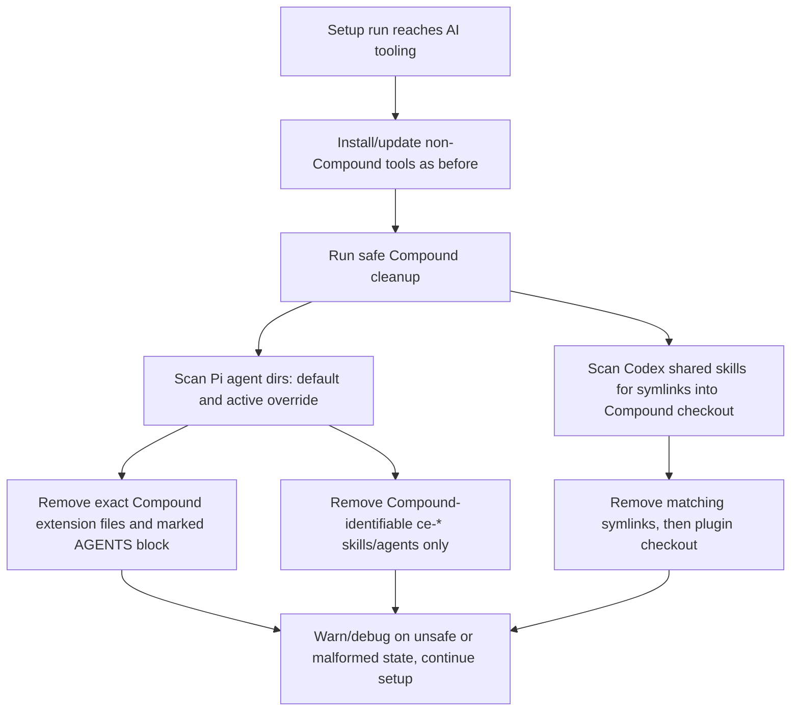

<!-- markdownlint-disable MD025 -->

# refactor: Remove Compound Engineering setup

## Summary

Remove Compound Engineering as a setup-managed agent plugin across every platform script. Future setup runs should not install, update, sanitize, or advertise Compound resources, and reruns should safely clean known legacy Compound artifacts while preserving Pi, Codex, RTK, tintinweb Pi subagents, Pi MCP adapter, Pi goal/autoresearch, and Matt Pocock skills.

---

## Problem Frame

The setup scripts currently treat Compound Engineering as part of the standard AI tooling footprint: Pi installs/sanitizes it on every platform, Omarchy installs Codex skill links from the Compound plugin repo, and docs/env templates expose `BAN_COMPOUND*` opt-outs. The desired state is simpler: Compound Engineering is no longer part of machine setup at all.

---

## Requirements

- R1. No active setup script installs, updates, sanitizes, or links Compound Engineering resources.
- R2. Rerunning setup removes known legacy Compound artifacts where they can be identified safely and idempotently.
- R3. Cleanup must not delete unrelated user, Pi, Codex, tintinweb, Matt Pocock, RTK, MCP adapter, or goal/autoresearch resources.
- R4. Generated `.env.local` templates and user-facing docs no longer mention `BAN_COMPOUND`, `BAN_COMPOUND_PLUGIN`, Compound Engineering setup, or Compound skip behavior.
- R5. Existing user-owned `.env.local` files with stale `BAN_COMPOUND*` values remain harmless; setup should not mutate user config just to remove old comments/flags.
- R6. Every modified setup script increments its version banner and replaces stale "Install Compound Engineering" last-changed text with a removal-focused description.
- R7. Removal/cleanup failures for optional agent artifacts warn or debug and continue; they must not abort full machine setup.
- R8. Verification distinguishes active setup/docs from historical `docs/plans/` records so intentional history is not rewritten just to satisfy a broad grep.

---

## Scope Boundaries

- Do not remove Pi, Codex, Claude Code, Gemini, RTK, tintinweb Pi subagents, Pi MCP adapter, Pi goal/autoresearch, or Matt Pocock skills.
- Do not edit shell profile files; dotfiles remain managed by chezmoi.
- Do not edit existing user-owned `.env.local` files to delete stale `BAN_COMPOUND*` values.
- Do not make `win.ps1` clean WSL/Linux home directories; Windows cleanup targets Windows user-profile paths only.
- Do not broadly delete arbitrary files under `~/.agents/skills`, `~/.pi/agent/skills`, or `~/.pi/agent/agents`; deletion must be limited to safe Compound-identifiable artifacts.
- Do not rewrite historical plan documents under `docs/plans/` except for adding this superseding plan.

---

## Context & Research

### Relevant Code and Patterns

- Bash Pi Compound functions exist in `mac.sh`, `ubuntu.sh`, `wsl.sh`, `pi.sh`, `omarchy.sh`, and `bazzite.sh` as `sanitize_pi_compound_engineering_for_pi` plus `setup_pi_compound_engineering`.
- `win.ps1` mirrors the Pi Compound flow with `Sanitize-PiCompoundEngineeringForPi` and `Setup-PiCompoundEngineering`.
- All setup scripts include `BAN_COMPOUND=1` and `BAN_COMPOUND_PLUGIN=1` in generated `.env.local` placeholder comments.
- Main-flow Pi setup call sites invoke Compound after other Pi extension setup: Bash scripts call `setup_pi_compound_engineering`; `win.ps1` calls `Setup-PiCompoundEngineering`.
- `omarchy.sh` has an additional Codex-only Compound path: `setup_codex_compound_skills` clones `https://github.com/EveryInc/compound-engineering-plugin.git` into `~/.local/share/compound-engineering-plugin` and symlinks skills into `~/.agents/skills`.
- Existing safe-removal patterns to follow include Pi settings package removal helpers, Matt Pocock skill cleanup across default/active Pi agent dirs, and Omarchy's symlink cleanup before repository deletion.
- Version banners must be updated in every modified script; `CLAUDE.md` requires this for setup-script changes.

### Institutional Learnings

- `docs/plans/2026-03-23-001-feat-replace-fnm-pyenv-with-mise-beta-plan.md` is the closest all-platform removal precedent: cover every setup target, preserve dotfile ownership boundaries, and update version headers.
- `docs/plans/2026-05-04-001-feat-install-tintinweb-pi-subagents-plan.md` and `docs/plans/2026-05-07-001-feat-install-pi-goal-autoresearch-plan.md` establish idempotent, non-fatal cleanup for optional Pi agent resources.
- `docs/plans/2026-05-07-002-feat-migrate-pi-earendil-works-package-plan.md` cautions that cleanup of agent tooling must avoid breaking shared shims or unrelated packages.
- `docs/plans/2026-07-09-001-feat-install-claude-code-cli-plan.md` reinforces that optional AI tooling failures should warn and continue, and that docs/version banners must stay aligned with setup-managed tooling.

### External References

- None. Local repository patterns are sufficient for this removal.

---

## Key Technical Decisions

- Replace install behavior with cleanup behavior, not just deletion of call sites: reruns should actively remove legacy Compound artifacts that this repo previously created or managed.
- Run safe cleanup after dotfiles application and after the Pi setup conditional where possible, so any managed `AGENTS.md` or agent-directory state reintroduced earlier in the run is cleaned last.
- Remove Codex-style `~/.agents/skills` entries only when they are symlinks whose target points inside `~/.local/share/compound-engineering-plugin`; then remove the plugin checkout directory.
- Remove Pi `AGENTS.md` Compound content only when exact `BEGIN COMPOUND PI TOOL MAP` and `END COMPOUND PI TOOL MAP` markers are present; warn and leave the file unchanged if the block is malformed.
- Remove Pi Compound skills/agents only when they are Compound-identifiable, such as generated `ce-*` resource directories under Pi agent `skills`/`agents` or symlinks into a Compound plugin checkout. Do not delete non-`ce-*` resources by name.
- Leave historical plan docs intact. Active docs, script templates, script output, and live setup behavior are the source of truth for the new state.

---

## Open Questions

### Resolved During Planning

- Should stale `BAN_COMPOUND*` values be removed from user `.env.local` files? No. Remove generated placeholders and docs only; ignore stale user values.
- Should `~/.agents/skills` cleanup delete by skill name? No. Delete only symlinks whose target is inside the Compound plugin checkout.
- Should malformed Pi `AGENTS.md` blocks be guessed around? No. Warn and skip block removal unless exact begin/end markers are present.
- Should historical plans be edited to remove old Compound mentions? No. They remain historical records; verification should account for that exemption.
- Should Windows cleanup reach into WSL homes? No. `win.ps1` cleans Windows-profile artifacts; `wsl.sh` cleans WSL/Linux artifacts.

### Deferred to Implementation

- Exact text-edit mechanism for removing the Pi `AGENTS.md` block: choose the simplest safe Bash/PowerShell implementation that preserves unrelated content and handles missing/malformed markers non-fatally.
- Exact Pi settings cleanup, if any: inspect whether the Compound plugin left package/settings entries and remove only entries whose package/source clearly contains Compound identifiers.

---

## High-Level Technical Design

> *This illustrates the intended approach and is directional guidance for review, not implementation specification. The implementing agent should treat it as context, not code to reproduce.*

---

## Implementation Units

### U1. Add safe Compound cleanup helpers for Bash setup scripts

**Goal:** Provide an idempotent cleanup path that removes known legacy Compound artifacts without relying on Bun, Pi, Codex, or the old Compound installer.

**Requirements:** R2, R3, R5, R7

**Dependencies:** None

**Files:**
- Modify: `mac.sh`
- Modify: `ubuntu.sh`
- Modify: `wsl.sh`
- Modify: `pi.sh`
- Modify: `omarchy.sh`
- Modify: `bazzite.sh`
- Test: none — this repo has no automated script test harness; validate through static checks and targeted content/state review.

**Approach:**
- Add a Bash cleanup helper near the other AI agent setup helpers in each Bash script.
- Target both `${HOME}/.pi/agent` and `${PI_CODING_AGENT_DIR}` when they differ, matching the existing Matt Pocock cleanup pattern.
- Remove `extensions/compound-engineering-compat.ts` and any narrowly named Compound extension artifacts.
- Remove the `AGENTS.md` block only when exact Compound begin/end markers are present.
- Remove `ce-*` resources under Pi `skills` and `agents` only when they are directories/symlinks that match the Compound-generated naming convention; do not remove unrelated names.
- Remove Codex-style symlinks under `~/.agents/skills` only when their symlink target points inside `~/.local/share/compound-engineering-plugin`, then remove that plugin checkout directory.
- If a safe edit or safe deletion cannot be performed, emit a warning/debug message and continue.

**Patterns to follow:**
- `remove_matt_pocock_pi_skills` for cleaning both default and active Pi agent directories.
- Existing Pi settings removal helpers for optional non-fatal cleanup behavior.
- `setup_codex_compound_skills` banned-flow ordering in `omarchy.sh`, but tighten it by scanning symlink targets before deleting the checkout.

**Test scenarios:**
- Happy path: no Compound artifacts exist; cleanup completes quietly/debug-only and setup continues.
- Happy path: `~/.pi/agent/extensions/compound-engineering-compat.ts` exists; cleanup removes it and preserves other extension files.
- Happy path: `~/.pi/agent/AGENTS.md` contains exact Compound begin/end markers; cleanup removes only that block and preserves surrounding content.
- Edge case: `AGENTS.md` has only one Compound marker; cleanup warns and leaves the file unchanged.
- Edge case: `${PI_CODING_AGENT_DIR}` points to a different active agent directory; cleanup checks both directories without failing if one is missing.
- Integration: `~/.agents/skills/foo` is a symlink into `~/.local/share/compound-engineering-plugin`; cleanup removes the symlink before removing the checkout.
- Error path: `~/.agents/skills/foo` is a normal directory or symlink outside the Compound checkout; cleanup preserves it.

**Verification:**
- Bash scripts contain a cleanup function but no installer, sanitizer, `bunx @every-env/compound-plugin`, or Compound skip-flag branches.
- Safe cleanup can be reasoned about from path/marker guards and does not require network access or optional agent CLIs.

---

### U2. Remove Bash Compound install/sanitize flows and invoke cleanup

**Goal:** Stop Bash setup scripts from installing/updating Compound while ensuring reruns clean old artifacts after normal agent setup.

**Requirements:** R1, R2, R3, R7

**Dependencies:** U1

**Files:**
- Modify: `mac.sh`
- Modify: `ubuntu.sh`
- Modify: `wsl.sh`
- Modify: `pi.sh`
- Modify: `omarchy.sh`
- Modify: `bazzite.sh`
- Test: none — validate through static checks and targeted content scans.

**Approach:**
- Delete `sanitize_pi_compound_engineering_for_pi` and `setup_pi_compound_engineering` from every Bash script.
- Remove `setup_pi_compound_engineering` call sites from every Bash main flow.
- Delete `setup_codex_compound_skills` and its call site from `omarchy.sh`.
- Invoke the new cleanup helper after the Pi setup conditional in each Bash script so cleanup runs even when `install_pi_cli` fails or Pi is already present.
- In `omarchy.sh`, ensure cleanup also replaces the old Codex Compound call path so the `~/.local/share/compound-engineering-plugin` checkout and its symlinks are handled.

**Patterns to follow:**
- Existing optional agent tooling order in each script's `Development Tools` / `Pi Extensions` section.
- Existing non-fatal warning style for optional setup failures.

**Test scenarios:**
- Happy path: fresh Bash setup no longer prints or executes any Compound install/update/sanitize message.
- Happy path: rerun after prior Pi Compound install removes known artifacts while still running non-Compound Pi extension setup.
- Integration: Omarchy rerun removes old Codex Compound symlinks/repo and still installs/updates Codex itself.
- Error path: Pi CLI installation fails; cleanup still removes file-based legacy artifacts and setup reaches the existing warning path.

**Verification:**
- Active Bash code has no `setup_pi_compound_engineering`, `sanitize_pi_compound_engineering_for_pi`, `setup_codex_compound_skills`, `@every-env/compound-plugin`, or `BAN_COMPOUND*` control flow.
- Non-Compound AI tooling call order remains otherwise unchanged.

---

### U3. Mirror removal and cleanup in Windows PowerShell

**Goal:** Bring `win.ps1` to the same no-Compound behavior as the Bash scripts for Windows user-profile artifacts.

**Requirements:** R1, R2, R3, R5, R7

**Dependencies:** U1 for conceptual cleanup rules

**Files:**
- Modify: `win.ps1`
- Test: none — validate with PowerShell parser/static checks when available.

**Approach:**
- Delete `Sanitize-PiCompoundEngineeringForPi` and `Setup-PiCompoundEngineering`.
- Add `Remove-CompoundEngineeringResources` using Windows home paths under `$env:USERPROFILE`.
- Apply the same safety rules: exact AGENTS block markers, Windows-profile Pi agent dirs only, `ce-*` Pi resources only when Compound-identifiable, and symlink/reparse-point cleanup only when targets point inside the Compound plugin checkout.
- Call cleanup after the Pi setup conditional in `Initialize-WindowsEnvironment`, regardless of whether Pi install/migration succeeded.
- Preserve existing warning/debug behavior and avoid throwing on missing paths.

**Patterns to follow:**
- Existing PowerShell `Remove-MattPocockPiSkills` cleanup style.
- Existing `Test-EnvLocalFlag`/optional-tool behavior for warning and continuing.

**Test scenarios:**
- Happy path: no Windows Compound artifacts exist; cleanup is a no-op and setup continues.
- Happy path: `%USERPROFILE%\.pi\agent\extensions\compound-engineering-compat.ts` exists; cleanup removes it without touching other extensions.
- Happy path: `%USERPROFILE%\.pi\agent\AGENTS.md` has exact Compound markers; cleanup removes only the marked block.
- Edge case: stale `BAN_COMPOUND=1` exists in the user's `.env.local`; setup ignores it and does not fail.
- Error path: PowerShell cannot safely identify a skill link target; cleanup preserves it and continues.

**Verification:**
- `win.ps1` has no Compound installer/sanitizer functions or call sites.
- PowerShell syntax parses where `pwsh` or Windows PowerShell is available.

---

### U4. Remove Compound-facing docs, env placeholders, and stale version text

**Goal:** Align generated setup guidance and user-facing documentation with the new no-Compound setup contract.

**Requirements:** R4, R6, R8

**Dependencies:** U2, U3

**Files:**
- Modify: `README.md`
- Modify: `CLAUDE.md`
- Modify: `mac.sh`
- Modify: `ubuntu.sh`
- Modify: `wsl.sh`
- Modify: `pi.sh`
- Modify: `omarchy.sh`
- Modify: `bazzite.sh`
- Modify: `win.ps1`
- Test: none — validate with markdown lint/static checks.

**Approach:**
- Remove `BAN_COMPOUND=1` and `BAN_COMPOUND_PLUGIN=1` from every generated `.env.local` placeholder block.
- Update early-source comments so they no longer cite `BAN_COMPOUND/BAN_COMPOUND_PLUGIN`.
- Update `README.md` AI tooling prose to omit Compound Engineering and its skip flags.
- Update `CLAUDE.md` common tools/guidance to omit Compound setup and skip flags while preserving Matt Pocock, Pi subagents, RTK, MCP adapter, goal/autoresearch, and Claude Code guidance.
- Increment version banners in all seven setup scripts and use a concise last-changed message such as `Remove Compound Engineering setup and clean legacy artifacts`.

**Patterns to follow:**
- Version number management rules in `CLAUDE.md`.
- Current README/CLAUDE AI tooling paragraphs for compact wording.

**Test scenarios:**
- Happy path: a newly generated `.env.local` placeholder no longer suggests Compound flags.
- Happy path: README and CLAUDE describe the supported AI tooling without Compound claims.
- Edge case: historical `docs/plans` references remain, but active docs/templates do not point users to Compound setup.

**Verification:**
- Active docs and generated templates no longer mention Compound Engineering or `BAN_COMPOUND*`.
- Each modified script version is incremented exactly once and last-changed text matches the removal.

---

### U5. Validate active removal coverage

**Goal:** Prove the repository no longer actively manages Compound while preserving intended historical references.

**Requirements:** R1, R3, R6, R8

**Dependencies:** U1, U2, U3, U4

**Files:**
- Validate: `mac.sh`
- Validate: `ubuntu.sh`
- Validate: `wsl.sh`
- Validate: `pi.sh`
- Validate: `omarchy.sh`
- Validate: `bazzite.sh`
- Validate: `win.ps1`
- Validate: `README.md`
- Validate: `CLAUDE.md`
- Validate: `docs/plans/2026-07-23-001-refactor-remove-compound-engineering-setup-plan.md`

**Approach:**
- Run content scans for Compound identifiers and classify remaining matches as either this plan/historical docs or active code/docs that still need cleanup.
- Run Bash syntax/static validation across modified shell scripts.
- Run PowerShell parser validation when PowerShell is available.
- Run markdown validation for changed Markdown files.
- Self-review cleanup guards for path safety before implementation is marked complete.

**Patterns to follow:**
- `lefthook.yml` pre-commit/pre-push lint surfaces.
- Existing plan verification notes for PowerShell parser checks when available.

**Test scenarios:**
- Happy path: active scripts/docs contain no Compound installer, skip flag, plugin URL, or user-facing setup claim.
- Integration: static validation passes for all modified Bash scripts after duplicated helper changes.
- Integration: `win.ps1` parses successfully where a PowerShell runtime exists.
- Edge case: content scans find historical `docs/plans` references; reviewer records them as intentionally out of active scope.

**Verification:**
- Diff review shows only Compound removal/cleanup, docs/template updates, version bumps, and the new plan.
- Validation output demonstrates no active Compound setup surface remains.

---

## System-Wide Impact

- **Interaction graph:** AI tooling setup still flows through the same Development Tools / Pi Extensions sections, but Compound install calls are replaced by final cleanup calls.
- **Error propagation:** Cleanup is optional and non-fatal; unsafe or malformed state should warn/debug and allow the rest of setup to finish.
- **State lifecycle risks:** Dotfiles or earlier setup steps may recreate agent files before cleanup; running cleanup late prevents reintroduced Compound blocks from surviving the same run.
- **API surface parity:** Bash and PowerShell should expose the same user-visible behavior: no Compound setup, safe legacy cleanup, stale env flags ignored.
- **Integration coverage:** Review must cover all seven platform entry points because duplicated setup logic can drift.
- **Unchanged invariants:** Non-Compound agent tooling remains setup-managed; dotfiles continue to own shell/profile configuration.

---

## Risks & Dependencies

| Risk | Mitigation |
|------|------------|
| Cleanup deletes user-owned skills with overlapping names. | Delete shared Codex skills only by symlink target; delete Pi skills/agents only when Compound-identifiable, with no broad directory wipes. |
| `AGENTS.md` block removal corrupts unrelated instructions. | Require exact begin/end markers and leave malformed files unchanged with a warning. |
| One platform script is missed because logic is duplicated. | Treat all six Bash scripts plus `win.ps1` as required touch surfaces and validate with active content scans. |
| Stale `BAN_COMPOUND*` values confuse users. | Remove docs/templates; do not mutate existing user config. Stale values become harmless no-ops. |
| Historical docs cause false-positive grep failures. | Define historical `docs/plans/` references as out of active cleanup scope and classify them during verification. |
| Cleanup runs before dotfiles reintroduce an `AGENTS.md` block. | Place cleanup after dotfiles/Pi setup where each script structure allows. |

---

## Documentation / Operational Notes

- README and CLAUDE are the active documentation surfaces to update; historical plans remain unchanged.
- Users who manually installed Compound outside these setup scripts may still need manual cleanup for artifacts that are not safely identifiable by path, marker, symlink target, or `ce-*` Compound naming.
- Existing `.env.local` files may keep stale commented or active `BAN_COMPOUND*` lines; they should no longer affect setup.

---

## Sources & References

- User request: remove Compound Engineering plugin(s) completely from setup.
- Related active docs: `README.md`, `CLAUDE.md`.
- Bash setup scripts: `mac.sh`, `ubuntu.sh`, `wsl.sh`, `pi.sh`, `omarchy.sh`, `bazzite.sh`.
- Windows setup script: `win.ps1`.
- Historical plan precedent: `docs/plans/2026-03-23-001-feat-replace-fnm-pyenv-with-mise-beta-plan.md`.
- Historical agent-tooling plans: `docs/plans/2026-05-04-001-feat-install-tintinweb-pi-subagents-plan.md`, `docs/plans/2026-05-07-001-feat-install-pi-goal-autoresearch-plan.md`, `docs/plans/2026-05-07-002-feat-migrate-pi-earendil-works-package-plan.md`, `docs/plans/2026-07-09-001-feat-install-claude-code-cli-plan.md`.
